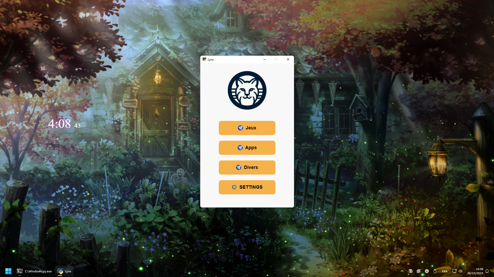

<body>
    <h1>🔎Lynx</h1>
    <h3>Un outil simple pour améliorer votre productivité</h3>
    
    
Ce projet consiste en une application d'interface graphique (GUI) développée en Python, utilisant le module webview pour afficher une fenêtre interactive. L'application permet de lancer des raccourcis configurés et d'afficher une interface utilisateur personnalisée avec des icônes et des titres dynamiques définis dans un fichier de configuration config.ini.

    
Pour l'installer sur windows, rendez vous dans les releases, extrayez le dossier compréssé, lancez "lynx.exe".

    <h2>Illustration</h2>
    
</body>
